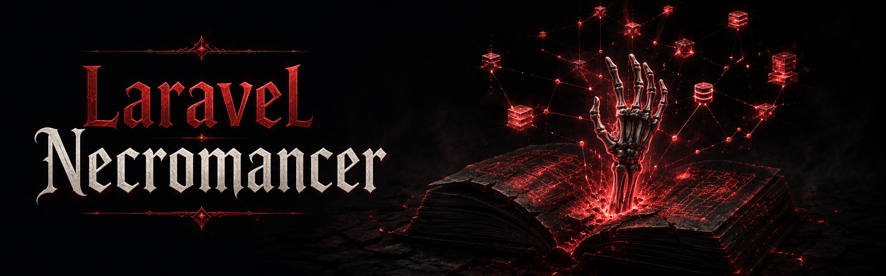

<p align="center">                                                                                                                                                                
                                                                                                                
</p>

Laravel Necromancer scans your bootstrapped Laravel application and builds a structured, machine-readable inventory called the **manifest**. From that manifest you can display a terminal map of your application, run an AI-readability audit, and generate a Markdown context file that AI coding agents can load as ambient context — so they always have an accurate picture of your routes, models, jobs, events, observers, scheduled tasks, middleware, Livewire components, gates, mailables, validation rules, service providers, and more.

## What Necromancer Collects

The manifest covers 18 artifact types across the full Laravel application structure:

| Type | What it surfaces |
|---|---|
| `routes` | Name, method, URI, controller, action, middleware, authorization, route metadata (domain, flow, capability, summary, risk, external services, ADR) |
| `models` | Table, fillable, casts, appends, relationships, scopes, observers, policy, factory |
| `jobs` | Queue, connection, tries, timeout, backoff, max_exceptions |
| `events` | Listeners, broadcastable channels |
| `listeners` | Handled events, queued status |
| `commands` | Signature, description, aliases |
| `form_requests` | Rules, stop_on_first_failure, error_bag |
| `policies` | Model, policy methods |
| `enums` | Backing type, cases |
| `tests` | File, type (unit/feature), subject class, test methods |
| `observers` | Model, lifecycle hooks, queued status |
| `scheduled_tasks` | Command, cron expression, human-readable schedule, flags |
| `middleware` | Alias, class, scope (global/group/alias), group name |
| `livewire_components` | View, public properties with types, action methods, listened events |
| `gates` | Ability, kind (closure/class/before_hook/after_hook), parameters |
| `mailables` | Subject, queued status, queue name, view/markdown template |
| `validation_rules` | Implicit flag, docblock description |
| `service_providers` | Deferred flag, source location |

All artifact types carry a `source` field with `file`, `line`, `line_end`, and `hash` for precise citations and stale detection.

Every class-backed type in the table above — `models`, `form_requests`, `jobs`, `events`, `listeners`, `commands`, `policies`, `enums`, `observers`, `livewire_components`, `mailables`, `validation_rules`, `service_providers` — plus `middleware` and route controllers/actions can also carry a declared `annotations` block (`domain`, `flow`, `capability`, `summary`, `risk`, `external_services`, `adrs`) via the `#[Necromancer]` attribute. See [Annotating class-backed artifacts, controllers, and middleware](#annotating-class-backed-artifacts-controllers-and-middleware) below. `gates`, `tests`, and `scheduled_tasks` — plus registration-specific overrides for every other type — are annotated instead through exact-ID mappings in configuration. See [Annotating non-reflectable artifacts with exact-ID mappings](#annotating-non-reflectable-artifacts-with-exact-id-mappings) below.

## Requirements

| | Version |
|---|---|
| PHP | ≥ 8.3 |
| Laravel | 13.x |

## Installation

Install the package as a development dependency:

```bash
composer require --dev robertogallea/laravel-necromancer
```

The service provider is auto-discovered — no manual registration is needed.

Optionally publish the configuration file:

```bash
php artisan vendor:publish --tag=necromancer-config
```

## Usage

Necromancer follows a **scan-first** workflow. Every other command reads the manifest produced by `necromancer:scan` rather than re-scanning the application.

### Step 1 — Scan

```bash
php artisan necromancer:scan
```

Inspects the running application and writes `necromancer.json` to the project root. Re-run this command whenever your application changes. Collect only specific artifact types with `--only`:

```bash
php artisan necromancer:scan --only=routes,models
php artisan necromancer:scan --only=observers,scheduled_tasks,gates
```

Necromancer reads PHP attributes (`#[ObservedBy]`, `#[Queue]`, `#[Aliases]`, `#[Authorize]`, etc.) as primary sources alongside class properties. Codebases using the attribute-based API introduced in Laravel 11+ are fully supported — jobs configured via `#[Queue]`/`#[Tries]`/`#[Timeout]`, models with `#[ObservedBy]`/`#[ScopedBy]`, and commands with `#[Aliases]` all appear correctly in the manifest.

Test files in `tests/Unit/` and `tests/Feature/` are scanned and included as a `tests` artifact type. Both Pest functional-style files (`test()`/`it()` calls) and class-based PHPUnit tests are supported. Subject classes are inferred from `uses()` declarations and filename convention (`OrderTest.php` → `App\Models\Order`).

On Laravel 13.17+, routes using the native [`Route::metadata()`](https://laravel.com/docs/routing#route-metadata) API are scanned too. Necromancer reads a reserved `necromancer` namespace within that metadata as a compact, declared-by-the-developer semantic signal — separate from anything Necromancer infers itself. The `withNecromancer()` route macro declares it:

```php
Route::post('/billing/cancel', [SubscriptionController::class, 'cancel'])
    ->withNecromancer(
        domain: 'billing',
        flow: 'subscription-cancellation',
        capability: 'subscription.cancel',
        summary: 'Cancels an active subscription.',
        risk: 'high',
        externalServices: ['stripe'],
        adr: 'docs/adr/004-subscription-cancellation.md',
    );
```

Every field is an optional named argument, and `externalServices` accepts either a single string or an array of strings. The macro is registered on every routing surface, so a whole group — or every route a resource registers — can be tagged in one place:

```php
// Group position, before or after any other group attribute
Route::withNecromancer(domain: 'billing')->prefix('billing')->group(/* ... */);
Route::prefix('billing')->withNecromancer(domain: 'billing')->group(/* ... */);

// Resource and singleton registrations
Route::resource('posts', PostController::class)->withNecromancer(domain: 'blog');
Route::singleton('profile', ProfileController::class)->withNecromancer(domain: 'account');
```

Routes inherit the fields declared by their group, and a field set on the route itself wins over the group's value for that field — Laravel's own route metadata merging, not a Necromancer behaviour.

The macro is a shorthand, never a parallel metadata system: it wraps the arguments you pass under the configured `route_metadata.namespace`, drops the ones left null, and hands the result to native `->metadata()`. The equivalent raw array is always supported, and is the form to use on Laravel < 13.17 — where `withNecromancer()` throws, since the framework has no route metadata to write to:

```php
Route::post('/billing/cancel', [SubscriptionController::class, 'cancel'])
    ->metadata([
        'necromancer' => [
            'domain' => 'billing',
            'risk' => 'high',
            'external_services' => ['stripe'],
        ],
    ]);
```

All fields are optional and the feature is entirely opt-in — apps that don't declare route metadata, or that run Laravel < 13.17, are unaffected; the `route_metadata` key is simply omitted from the manifest. Keep values compact (labels, identifiers, ADR references) rather than long narrative descriptions — ADRs, domain docs, and the generated context file remain the right place for extended architectural explanations. This declared metadata takes priority over any naming/namespace-based inference Necromancer performs, and — resolved alongside annotations declared on every other artifact family — is used by `necromancer:doctor` (Artifact Annotation Coverage scoring), `necromancer:audit` (quality checks), `necromancer:generate` (route table columns and the Architectural Context column on every other section), and `necromancer:diff` (flagged high-risk/external-service artifacts) — see each command's section below.

#### Annotating class-backed artifacts, controllers, and middleware

The same `domain`/`flow`/`capability`/`summary`/`risk`/`externalServices`/`adrs` fields can be declared directly on a class or method with the `#[Necromancer]` attribute, so artifacts that aren't routes get the same declared-intent signal:

```php
use LaravelNecromancer\Attributes\Necromancer;
use LaravelNecromancer\Metadata\Risk;

#[Necromancer(domain: 'billing', capability: 'invoice.send', risk: Risk::High, externalServices: ['stripe'])]
final class SendInvoiceEmail implements ShouldQueue
{
    // ...
}
```

The attribute is a single, non-repeatable declaration and applies directly to every class-backed artifact type: models, form requests, jobs, events, listeners, commands, policies, enums, observers, Livewire components, mailables, validation rules, and service providers.

On a controller, a class-level attribute supplies defaults for every action, and a method-level attribute refines them — the action wins for any field it declares, silently, with no warning:

```php
#[Necromancer(domain: 'billing', risk: Risk::Low)]
final class SubscriptionController
{
    #[Necromancer(capability: 'subscription.cancel', risk: Risk::High)]
    public function cancel(): RedirectResponse { /* ... */ }
}
```

`cancel()`'s route annotations resolve to `domain: billing` (inherited), `capability: subscription.cancel`, and `risk: high` (refined). Native `Route::metadata()` — including the `withNecromancer()` macro — remains the most specific declaration and overrides a conflicting controller-derived value; when it does, `necromancer:scan` prints an `AN_SOURCE_CONFLICT` warning naming the field so the disagreement isn't silent.

A middleware class annotation applies to every place that middleware is registered — globally, in a group, or under an alias each produce their own manifest entry, but all of them carry the same annotations:

```php
#[Necromancer(domain: 'security', risk: Risk::High)]
final class EnsureTwoFactorIsEnabled
{
    // ...
}
```

#### Annotating non-reflectable artifacts with exact-ID mappings

Closures, test files, gates, and scheduled tasks have no class or method to carry a `#[Necromancer]` attribute. The `annotations` key in `config/necromancer.php` covers these — and adds a registration-specific override on top of any other family, including middleware — by mapping an exact, opaque canonical Artifact ID (the same `id` every artifact already carries in the manifest) to a Schema v1 field array:

```php
'annotations' => [
    'gates:ability:edit-post' => [
        'domain' => 'content',
        'risk' => 'low',
    ],
    'middleware:group:web:App\\Http\\Middleware\\EnsureTwoFactorIsEnabled' => [
        'capability' => 'security.two-factor',
    ],
],
```

Keys must be exact IDs — there is no wildcard or pattern syntax, and an unresolvable made-up ID is never allowed to invent an artifact. A mapping only **fills** an annotation field left absent by every other declaration source; when it disagrees with an already-resolved value (a `#[Necromancer]` attribute, a controller annotation, or native route metadata), the existing value wins and `necromancer:scan` prints an `AN_SOURCE_CONFLICT` warning. List fields (`external_services`, `adrs`) are additive: config values are appended after whatever was already resolved, with exact deduplication. An unknown field name, an empty scalar, an invalid `risk` value, or a wildcard/malformed key fails the scan before anything is written, leaving an existing manifest untouched — the same controlled-failure behavior invalid `#[Necromancer]` attribute values already produce. A mapping whose artifact type is included in the current scan but whose exact ID matches nothing collected prints a non-fatal `AN_CONFIG_UNMATCHED` warning; a mapping for a type outside a `--only` scan's scope is silently skipped.

Check for manifest drift without writing a new file (CI use):

```bash
php artisan necromancer:scan --diff                         # show added/removed artifacts
php artisan necromancer:scan --diff --fail-on-drift        # exit 1 when drift detected
```

### Step 2 — Explore (optional)

Display the full application inventory in the terminal:

```bash
php artisan necromancer:map
```

Narrow the output to a single artifact type:

```bash
php artisan necromancer:map --type=routes
php artisan necromancer:map --type=models
```

### Step 3a — Audit AI readability

Check how well your application can be understood by an AI coding agent:

```bash
php artisan necromancer:audit
```

Each finding is grouped by severity (error / warning / suggestion). The score is a weighted pass-rate across all checks — normalized by the number of applicable artifacts — so an app with 1 unnamed route out of 50 scores far better than one with 1 out of 1. Errors weigh 3×, warnings 2×, and suggestions 1× in the calculation. Any artifact carrying declared Artifact Annotations — not just routes — is checked for quality: a `risk: high`/`critical` artifact with no `adrs` reference, an `external_services` artifact with no matching test subject, a `summary` over 200 characters (narrative content that belongs in an ADR instead), artifacts sharing the same `flow` that disagree on `domain` or `risk` (a single business process should agree on both), non-canonical or near-duplicate `domain`/`flow`/`capability`/`external_services` spelling, and `adrs` entries pointing at a local file that doesn't exist all produce findings — but only for artifacts that have actually declared annotations, so adopting the feature is never required to keep a clean audit. Output a shareable or machine-readable report, or enforce a CI gate:

```bash
php artisan necromancer:audit --format=markdown              # paste into a GitHub issue or PR
php artisan necromancer:audit --format=markdown --output=audit.md
php artisan necromancer:audit --format=json --output=audit.json
php artisan necromancer:audit --fail-on=error    # exit 1 if any errors (CI use)
php artisan necromancer:audit --fail-on=warning  # exit 1 if any warnings or errors
```

### Step 3b — Check the AI readability score

Get a quick percentage score across eight weighted dimensions of AI readability:

```bash
php artisan necromancer:doctor
```

Each dimension shows a progress bar, a percentage, and a detail line:

```
  Laravel Necromancer — AI Readability Score
  ──────────────────────────────────────────
  Score: 74%

  Route Clarity          ████████░░  82%  (12/15 named · 14/15 controller-backed)
  Model Expressiveness   ██████░░░░  61%  (3/5 casts · 4/5 fillable · 2/5 relationships)
  Authorization Coverage ███████░░░  70%  (2/3 policies · 8/12 write routes with auth)
  Validation Coverage    ████████░░  80%  (8/10 write routes with FormRequest)
  Async Clarity          ████████░░  83%  (4/5 jobs configured · 4/4 events with listeners)
  Codebase Vocabulary    ██████░░░░  63%  (5/8 commands described · 1/1 backed enums)
  Test Presence          ████████░░  80%  (4/5 models · 3/3 jobs)
  Artifact Annotation Cov.████████░░  83%  (5/6 tagged with domain · 2/2 high-risk with ADR · 1/2 external-service artifacts tested · 4/4 flow-consistent)

  Tip: run necromancer:audit for a detailed findings list.
```

Artifact Annotation Coverage scores N/A (and doesn't affect the overall score) until at least one artifact of any family declares Artifact Annotations — adopting the feature is entirely optional. Its emitted dimension key stays `route-metadata-coverage` throughout 1.x for CI/automation compatibility; `--only=artifact-annotation-coverage` is accepted as a forward-compatible alias for the same key.

Output a machine-readable score or enforce a CI gate:

```bash
php artisan necromancer:doctor --json
php artisan necromancer:doctor --min-score=80        # exit 1 when score < 80 (CI use)
php artisan necromancer:doctor --only=route-clarity  # score a single dimension
```

### Step 3c — Generate AI context

Write a Markdown context file your AI tool can load:

```bash
php artisan necromancer:generate
```

Produces `NECROMANCER.md` at the project root. The generated file includes a `## Tests` table when test artifacts are present:

```markdown
## Tests (12)
| File | Type | Subject | Tests |
|---|---|---|---|
| tests/Unit/Models/OrderTest.php | unit | Order | it creates an order, it calculates total |
| tests/Feature/OrderCheckoutTest.php | feature | | test_it_completes_checkout |
```

Routes render their Domain/Risk/External Services/ADR columns from resolved Artifact Annotations (declared via route metadata, a `#[Necromancer]` attribute, or an exact-ID configuration mapping). Every other artifact section — models, jobs, events, and the rest — renders a single compact `Architectural Context` column whenever at least one of its artifacts declares annotations, so developer intent stays visible without a dedicated column per field:

```markdown
## Jobs (1)
| Name | Queue | Connection | Tries | Architectural Context |
|---|---|---|---|---|
| SyncStripeInvoices | billing | redis | 3 | domain: billing · risk: high · external services: stripe |
```

The column is omitted entirely for a section where no artifact declares annotations.

Generate only specific sections:

```bash
php artisan necromancer:generate --only=routes,models
php artisan necromancer:generate --only=observers,scheduled_tasks
php artisan necromancer:generate --only=gates,middleware,mailables
```

Supported types: `routes`, `models`, `form_requests`, `jobs`, `events`, `listeners`, `commands`, `policies`, `enums`, `tests`, `observers`, `scheduled_tasks`, `middleware`, `livewire_components`, `gates`, `mailables`, `validation_rules`, `service_providers`.

Exclude specific sections instead of listing everything you want:

```bash
php artisan necromancer:generate --except=listeners
php artisan necromancer:generate --except=listeners,validation_rules,service_providers
```

`--only` and `--except` are mutually exclusive.

Filter by source path to generate context for just one slice of the application:

```bash
php artisan necromancer:generate --paths=app/Models,app/Http/Controllers/Admin
php artisan necromancer:generate --only=models --paths=app/Models
```

`--paths` matches each artifact's `source.file` by path prefix (after normalizing slashes) and is applied on top of `--only`/`--except`, so it can be combined with either. Paths are case-sensitive on Linux and case-insensitive on macOS/Windows, following the filesystem. Artifacts without a source file (closure routes, inline gates) are excluded while `--paths` is active, sections that end up empty are omitted, and a path that matches nothing emits a warning without failing.

Skip the overwrite confirmation when regenerating:

```bash
php artisan necromancer:generate --force
```

Write to a custom path:

```bash
php artisan necromancer:generate --output=.ai/context/app.md
```

### Step 3d — Ask a question about your codebase

Ask a natural-language question and get a grounded answer from your manifest:

```bash
php artisan necromancer:ask "What routes require authentication?"
```

If you omit the question, the command prompts you interactively. The manifest is injected verbatim into the AI's context, so answers are grounded in your actual application — not a model's prior knowledge. A warning is shown if the manifest may be stale.

The full manifest is always included — nothing is discarded — but a "Most Relevant Evidence" section is prepended ahead of it, ranking the artifacts most related to your question so the AI's attention is prioritized rather than left to search the whole payload unguided. Ranking uses the same keyword scoring as `necromancer:prompt`, boosted for declared Artifact Annotations on any artifact family: a `domain`/`flow`/`capability` counts as strongly as its name or class, since that's an intentional signal from the developer rather than something inferred from naming.

```bash
php artisan necromancer:ask                                        # interactive prompt
php artisan necromancer:ask "..." --provider=anthropic             # provider override
php artisan necromancer:ask "..." --model=claude-sonnet-4-5        # model override
```

> **Requires** `laravel/ai` installed and an AI provider configured in `config/ai.php`.

### Inspect the AI payload

Before committing to a provider, check exactly what Necromancer sends to the AI and how large the payload is:

```bash
php artisan necromancer:inspect-payload
```

Prints the full manifest JSON, the estimated token count, and a breakdown of artifact type counts. Pass `--privacy` to see the condensed privacy-safe summary instead (the payload used when a privacy-conscious provider is configured):

```bash
php artisan necromancer:inspect-payload --privacy
```

---

### Step 3e — Infer Architecture Decision Records

Generate [Architecture Decision Records](https://adr.github.io/) from the manifest using an AI provider:

```bash
php artisan necromancer:infer
```

> **Requires** `laravel/ai` installed and an AI provider configured in `config/ai.php`.

#### Options

| Option | Description |
|---|---|
| `--locale=it` | Translate ADRs into additional locales (comma-separated, e.g. `--locale=it,fr`). The default app locale is always inferred first; extra locales are translated from it. |
| `--temperature=0` | LLM temperature (0.0–2.0). Lower values produce more deterministic output. Omit to use the provider default. |
| `--max-critic-rounds=N` | Maximum number of critic review rounds (default 1). The loop exits early if the critic is satisfied before reaching N. |
| `--dry-run` | Print ADRs to the terminal without writing files. |
| `--force` | Overwrite existing ADR files without confirmation. |
| `--fresh` | Delete all existing ADR files and the inference cache, then re-infer from scratch. |
| `--refresh` | Bypass the cache and re-infer even if the manifest has not changed. |

#### Output

ADRs are written to `docs/adr/necromancer/` (canonical locale, flat) and `docs/adr/necromancer/{locale}/` for each translated locale. Each file follows the [Nygard ADR format](https://cognitect.com/blog/2011/11/15/documenting-architecture-decisions):

```markdown
# ADR 0001: Async Email Delivery via Dedicated Queue

**Status:** Inferred
**Dimension:** Async Processing
**Confidence:** High
**Date:** 2026-05-29

## Context
...

## Decision
...

## Consequences
...

## Counter-Evidence
No contradicting evidence found in the manifest.
```

#### Decision Taxonomy

The inference agent evaluates nine architectural dimensions and produces at most one ADR per dimension:

| Dimension | What it covers |
|---|---|
| `async-processing` | Jobs, queues, workers, retry strategy |
| `authorization` | Policies, gates, middleware auth guards |
| `event-driven` | Events, listeners, broadcasting |
| `api-design` | Route structure, API resources, versioning |
| `data-modeling` | Model relationships, casts, soft deletes |
| `command-scheduling` | Artisan commands, scheduled tasks |
| `form-validation` | Form requests vs inline validation |
| `external-services` | Mail, storage, payment, third-party services |
| `architecture-pattern` | Service layer, repository, MVC deviations |

#### Critic Agent

By default, a second AI pass reviews and filters the initial ADRs, removing generic observations and improving specificity. Configure via `config/necromancer.php`:

```php
'inference' => [
    'critic' => [
        'enabled' => true,   // set to false to disable the critic entirely
    ],
],
```

Use `--max-critic-rounds=N` to run up to N review passes. The critic signals when it is satisfied; the loop exits early even if N has not been reached. Each unsatisfied round adds one AI call.

```bash
# Two critic rounds at most (exits early if satisfied after round 1)
php artisan necromancer:infer --temperature=0 --max-critic-rounds=2
```

#### Caching

The command caches inference results in `docs/adr/necromancer/.adr-inference-cache.json`. The cache key is derived from `meta.content_hash` (a SHA-256 of the artifact payload written into every manifest by `necromancer:scan`), plus the temperature and critic settings. Because the hash covers only artifact data — not the scan timestamp — the cache survives re-scans that find no structural changes. On subsequent runs:

- **Unchanged codebase** — cached ADRs are used even if `necromancer:scan` was re-run; no AI call.
- **New `--locale` added** — only the translation call is made; inference is skipped.
- **`--refresh`** — forces re-inference with an unchanged manifest.
- **`--fresh`** — clears the cache and all ADR files before re-inferring.

#### Multi-Locale Workflow

```bash
# Generate canonical ADRs in the app locale (config('app.locale'))
php artisan necromancer:infer --temperature=0

# Add Italian translation without re-running inference
php artisan necromancer:infer --temperature=0 --locale=it

# Regenerate everything from scratch
php artisan necromancer:infer --temperature=0 --fresh
```

---

### Step 3f — Generate a source-grounded prompt

Build a ready-to-paste AI prompt grounded in the most relevant manifest entries for your question:

```bash
php artisan necromancer:prompt "Where is tenant isolation enforced?"
```

Necromancer keyword-searches the manifest, ranks artifacts by relevance, and outputs a formatted prompt block with `file:line` citations that you can paste into any AI tool (Claude, ChatGPT, Cursor, etc.).

```
You are analyzing MyApp, a Laravel 13 application.

Use the following source-grounded manifest entries:
- app/Http/Middleware/SetTenant.php:15-61
- app/Models/Project.php:12-44
- app/Http/Requests/CreateProjectRequest.php:1-38

Question:
Where is tenant isolation enforced?

Rules:
- Only answer from cited sources.
- Mention missing evidence.
- Do not assume runtime behavior not shown in code/tests.
```

If `laravel/ai` is installed, the question is automatically reformulated into a precise, application-aware version before being included in the prompt. Pass `--no-ai` to use the raw question instead.

```bash
php artisan necromancer:prompt "authentication" --no-ai    # skip AI reformulation
php artisan necromancer:prompt "billing" --top=5           # limit to 5 citations
php artisan necromancer:prompt "auth" --output=prompt.txt  # write to file
php artisan necromancer:prompt                             # interactive question prompt
```

> **AI reformulation** requires `laravel/ai` installed and configured. The command works without it — only the question contextualization step is skipped.

---

### Step 3g — Compare manifests across branches

Review the architectural changes introduced by a branch compared to another:

```bash
php artisan necromancer:diff main
```

Compares the current manifest against the manifest on the `main` branch. The output shows added, removed, and modified routes, models, jobs, events, listeners, policies, and other artifacts.

When an added or changed artifact of any family — not just routes — declares `risk: high`/`critical` or a non-empty `external_services` via its resolved Artifact Annotations, it's called out in a dedicated "Flagged Artifacts" section before the rest of the diff — this is a deterministic check, so it shows up even without `--review`/`laravel/ai`. Each flagged artifact also shows its `domain`, `flow`, and `capability` when declared, so reviewers see business context alongside the trigger:

```text
FLAGGED ARTIFACTS
⚠  routes  POST /billing/cancel (billing.cancel)  domain: billing · flow: subscription-cancellation · capability: subscription.cancel · risk: high
```

#### Options

| Option | Description |
|---|---|
| `--base-manifest=PATH` | Use a specific manifest file instead of comparing branches. Useful for comparing against a snapshot. |
| `--review` | Enable AI-powered analysis of the changes (requires `laravel/ai`). Produces a narrative summary of the architectural impact, detected risks, and suggested reviewer questions. |
| `--format=markdown` | Output in Markdown format (suitable for pasting into PRs or issues). |
| `--output=PATH` | Write the report to a file instead of printing to the terminal. |

#### Example: Basic diff

```bash
php artisan necromancer:diff main
```

Output:

```text
Comparing current manifest to main branch

Added:
  - Route: POST /api/subscriptions (SubscriptionController@store)
  - Model: App\Models\Subscription
  - Event: App\Events\SubscriptionCreated
  - Listener: App\Listeners\SendSubscriptionEmail (queued)
  - Job: App\Jobs\ProcessSubscriptionActivation

Modified:
  - Route: GET /dashboard (Dashboard parameter added)
  - Model: User (new cast: subscription_tier)

Removed:
  - Policy: App\Policies\TrialPolicy
```

#### Example: AI-powered review

```bash
php artisan necromancer:diff main --review --format=markdown
```

Output (when `laravel/ai` is installed):

```markdown
## Architectural Changes

This PR introduces a subscription model with activation workflow.

### Evidence
- New listener: SendSubscriptionEmail (queued)
- New job: ProcessSubscriptionActivation
- New event: SubscriptionCreated
- Modified route: GET /dashboard (dashboard parameter added)

### Risks
- No failed-activation test detected.
- No policy for Subscription model.
- Job retry strategy not configured.

### Suggested Reviewer Questions
1. Should subscription activation be idempotent?
2. What happens if the activation job fails multiple times?
3. Is SendSubscriptionEmail queued appropriately?
```

> **Note:** The `--review` option requires `laravel/ai` to be installed and configured. Without it, only the basic diff is shown. Both branches must have a committed `necromancer.json` manifest.

The AI reviewer's prompt includes the same "Flagged Artifacts" signal shown in the deterministic diff (high/critical-risk and external-service artifacts of any family, with `domain`/`flow`/`capability` when declared) — so its risk assessment is grounded in what you actually declared via Artifact Annotations, not left to infer risk purely from the raw diff.

---

### Step 3h — Benchmark AI context effectiveness

Measure how much Necromancer's generated context file improves AI coding-assistant accuracy, hallucination rate, and token cost compared to a hand-written `AGENTS.md` or no context at all:

```bash
php artisan necromancer:benchmark
```

The command runs a bundled task suite in three conditions — no context, manual `AGENTS.md`, and Necromancer-generated `NECROMANCER.md` — and reports the results side by side. An optional cross-model AI judge scores quality; automated fact-checks always run.

Q&A tasks (which measure context *coverage*) only run under the `none` and `manual` conditions — Necromancer would trivially score 100% since the answers are in the context file it generated. Code generation and mini tasks run across all three conditions and measure actual effectiveness.

```bash
php artisan necromancer:benchmark --no-judge              # automated checks only (single provider)
php artisan necromancer:benchmark --format=markdown --output=benchmark.md
php artisan necromancer:benchmark --generate-suite        # generate a suite grounded to your app's manifest
```

> See **[BENCHMARK.md](BENCHMARK.md)** for full setup instructions, config reference, and bias mitigations.

---

### Step 3i — Export an OKF Knowledge Bundle

Project the manifest into a portable, deterministic Open Knowledge Format (OKF) bundle — one Markdown file per artifact, with authoritative YAML front matter and a concise prose mirror:

```bash
php artisan necromancer:okf
```

Writes to `okf/` at the project root by default: `okf/bundle.json` (a small index with the bundle version and artifact count) plus one file per artifact under `okf/artifacts/`, named from a readable slug and a short hash of the artifact's canonical ID (e.g. `app-jobs-sendinvoice-20237e38.md`) — the filename is for browsability only, never authoritative; the `necromancer.id` field inside each file's front matter is.

```markdown
---
title: "SendInvoiceEmail"
type: "artifact"
kind: "jobs"
tags:
  - "billing"
necromancer:
  schema_version: 1
  bundle_version: "0.2"
  id: "jobs:App\\Jobs\\SendInvoiceEmail"
  artifact_type: "jobs"
  generated_at: "2026-08-07T12:00:00+02:00"
  facts:
    queue: "emails"
    tries: 3
  annotations:
    domain: "billing"
    risk: "high"
---

# SendInvoiceEmail

_jobs artifact_

## Architectural Context

domain: billing · risk: high

## Discovered Facts

- **queue**: `emails`
- **tries**: `3`
```

Every field is deterministic: `generated_at` always comes from the manifest's own `meta.generated_at`, never the export clock, so re-exporting an unchanged manifest produces byte-identical files. The bundle never becomes a competing source of truth — it's a read-only projection of the manifest, safe to regenerate at any time and never consulted by Necromancer itself.

By default the command refuses to export a manifest that looks stale (source files changed since the last scan) or whose scan was partial (`--only=` was used, or it's an old unversioned manifest) — both are exit-1 failures with an actionable message, not silent best-effort output:

```bash
php artisan necromancer:okf --allow-stale      # export anyway, e.g. in a throwaway CI check
php artisan necromancer:okf --allow-partial    # export a deliberately narrow bundle
php artisan necromancer:okf --output=dist/okf  # write elsewhere
```

Output replacement is safe to interrupt: the whole bundle is built in a temporary directory first, and the real output directory is only ever replaced once every file has been written successfully — a failed export never leaves a previously-generated bundle damaged.

#### Relationships, Domain/Flow concepts, and ADRs

When an artifact's already-collected fields name another artifact by class — a route's `controller`, a model's `relationships`/`policy`/`observers`, an event's `listeners`, a listener's `handles`, a policy's or observer's `model` — the Artifact Concept's body gains a `## Relationships` section rendering each as a Markdown link to that artifact's own concept file when it's resolvable in the bundle, or as plain text when it isn't (a vendor class, or one Necromancer didn't collect):

```markdown
## Relationships

- **controller**: [App\Http\Controllers\OrderController](/artifacts/order-controller-9f21ab34.md)
```

Every artifact tagged with the same `domain` or `flow` annotation value is also made navigable through a synthesized **Domain Concept** or **Flow Concept** — one file per distinct value, linking every member artifact:

```markdown
---
title: "billing"
type: "domain"
necromancer:
  schema_version: 1
  bundle_version: "0.2"
  id: "domain:billing"
  concept_type: "domain"
  members:
    - "jobs:App\\Jobs\\SendInvoiceEmail"
    - "routes:POST:billing/cancel"
---

# billing

_domain concept_

## Artifacts

- [App\Jobs\SendInvoiceEmail](/artifacts/app-jobs-sendinvoiceemail-20237e38.md)
- [POST billing/cancel](/artifacts/post-billing-cancel-9f21ab34.md)
```

A locally declared `adrs` reference (anything that isn't an absolute URI) is resolved against the application's base path, copied into the bundle as its own **ADR Concept** with provenance, and linked from every artifact that declared it — an absolute URI stays an external Markdown link instead of being copied:

```markdown
adrs: [docs/adr/0004-subscription-cancellation.md](/artifacts/0004-subscription-cancellation-1a2b3c4d.md)
```

A declared local ADR that doesn't exist on disk fails the whole export before anything is written, naming the missing path — the same controlled-failure behavior as a stale or partial manifest.

---

## Commands Reference

| Command | Purpose | Key options |
|---|---|---|
| `necromancer:scan` | Build the application manifest | `--output=PATH`, `--diff`, `--fail-on-drift` |
| `necromancer:map` | Display the manifest in the terminal | `--type=TYPE` |
| `necromancer:audit` | Run the AI-readability audit (violation list) | `--format=text\|json\|markdown`, `--output=PATH`, `--fail-on=SEVERITY` |
| `necromancer:doctor` | Show the AI readability score (percentage dashboard) | `--json`, `--min-score=N`, `--only=KEYS` |
| `necromancer:generate` | Generate the Markdown context file | `--only=TYPE,TYPE`, `--except=TYPE,TYPE` (18 types: routes, models, jobs, events, listeners, commands, form_requests, policies, enums, tests, observers, scheduled_tasks, middleware, livewire_components, gates, mailables, validation_rules, service_providers), `--paths=PATH,PATH`, `--output=PATH`, `--force` |
| `necromancer:ask` | Ask a question about your codebase via AI | `--provider=`, `--model=` |
| `necromancer:inspect-payload` | Show the AI payload size and content for `necromancer:ask` | `--privacy` |
| `necromancer:prompt` | Generate a source-grounded prompt for any AI tool | `--top=N`, `--no-ai`, `--output=PATH` |
| `necromancer:infer` | Generate ADRs via AI | `--locale=`, `--temperature=`, `--fresh`, `--refresh` |
| `necromancer:diff` | Compare manifests across branches | `--base-manifest=PATH`, `--review`, `--format=markdown`, `--output=PATH` |
| `necromancer:benchmark` | Benchmark AI context effectiveness (accuracy, hallucination rate, token cost) | `--condition=`, `--type=`, `--no-judge`, `--model=`, `--judge=`, `--format=`, `--output=PATH` |
| `necromancer:okf` | Export a deterministic OKF Knowledge Bundle (one Artifact Concept per artifact) | `--output=PATH`, `--allow-stale`, `--allow-partial` |

## Configuration

After publishing the config, edit `config/necromancer.php`:

```php
return [

    // Artifact exclusions — supports wildcard patterns for routes and glob patterns for tests
    'exclude' => [
        'routes'     => ['horizon.*', 'telescope.*', 'debugbar.*'],  // matched against the route NAME
        'route_uris' => ['up'],                                      // matched against the route URI (works for unnamed routes such as Laravel's /up health check)
        'models'     => [],
        'tests'      => [],   // glob patterns matched against relative file paths, e.g. 'tests/Fixtures/*'
    ],

    // Test discovery roots — override the default tests/Unit and tests/Feature scan paths
    'tests' => [
        'roots' => [
            // ['path' => base_path('tests/Unit'), 'type' => 'unit'],
            // ['path' => base_path('tests/Feature'), 'type' => 'feature'],
        ],
    ],

    // Output paths (defaults shown)
    'output' => [
        'manifest' => base_path('necromancer.json'),
        'context'  => base_path('NECROMANCER.md'),
    ],

    // OKF Knowledge Bundle output directory (necromancer:okf)
    'okf' => [
        'output' => base_path('okf'),
    ],

    // Laravel Boost integration
    'boost' => [
        'context_path' => base_path('.ai/guidelines/necromancer.md'),
    ],

    // Route metadata (Laravel 13.17+ Route::metadata()) — the namespace key Necromancer reads
    'route_metadata' => [
        'namespace' => 'necromancer',
    ],

    // Exact-ID annotation mappings for non-reflectable artifacts (closures, test
    // files, gates, scheduled tasks) and registration-specific overrides for
    // reflectable ones. Keys MUST be exact canonical Artifact IDs — no wildcards.
    'annotations' => [
        // 'jobs:App\\Jobs\\SendInvoice' => [
        //     'domain' => 'billing',
        //     'capability' => 'invoice.send',
        //     'risk' => 'high',
        // ],
    ],

];
```

## Privacy & Exclusions

Necromancer is designed to be safe to version by default:

- It never reads `.env` or raw configuration values.
- It never collects or stores application secrets.
- Routes registered by Horizon, Telescope, and Debugbar are excluded from scans automatically.
- Laravel's default `/up` health-check endpoint is excluded automatically via `exclude.route_uris`, so it never shows up as an unnamed-route audit finding.

To exclude additional routes or models, add patterns to the `exclude` key in `config/necromancer.php`. The `exclude.routes` patterns match against the route **name** (and therefore never match unnamed routes); use `exclude.route_uris` to exclude routes by **URI** — including unnamed ones such as health checks. Both use `Str::is()` wildcard matching, and route URIs are matched without a leading slash (e.g. `up`, `orders/*`). Exclusions apply to every downstream command — map, audit, doctor, and generate — so excluded artifacts never appear in results.

## Laravel Boost Integration

When [Laravel Boost](https://github.com/laravel/boost) is installed, `necromancer:generate` automatically writes the context file to `.ai/guidelines/necromancer.md` (configurable via `boost.context_path`) instead of `NECROMANCER.md`. Boost remains responsible for composing the final agent context; Necromancer only contributes its section.

An explicit `--output=PATH` flag always takes precedence over the Boost path.

## MCP Tools

When [Laravel MCP](https://github.com/laravel/mcp) is installed, Necromancer automatically exposes the manifest as read-only MCP tools via a `laravel-necromancer` server handle:

| Tool | Description |
|---|---|
| `query_routes` | List routes, optionally filtered by method or name/URI pattern |
| `query_models` | List Eloquent models, optionally filtered by class name |
| `query_artifacts` | List artifacts of any current type, optionally filtered by JSON substring |
| `search_artifacts` | Full-text search across all artifact types |

Use `query_artifacts` when you already know the artifact type (`routes`, `models`, `form_requests`, `jobs`, `events`, `listeners`, `commands`, `observers`, `policies`, `enums`, `tests`, `scheduled_tasks`, `middleware`, `livewire_components`, `gates`, `mailables`, `validation_rules`, or `service_providers`). Use `search_artifacts` when you need to search across types.

When `laravel/mcp` is present, Necromancer also writes its entry into `.mcp.json` automatically on the first `php artisan` run after installation — no manual configuration needed. If `.mcp.json` already exists, the entry is merged without touching other servers.

AI agents connected via Claude Code, Cursor, or any MCP client can then call these tools directly rather than reading `necromancer.json` by hand.

> **Requires** `laravel/mcp` installed. Run `php artisan necromancer:scan` to ensure the manifest is current before connecting an agent.

## CI Integration

Add these steps to your CI pipeline to enforce manifest freshness and AI-readability quality:

```yaml
- name: Check manifest is up to date
  run: php artisan necromancer:scan --diff --fail-on-drift

- name: Fail on AI-readability errors
  run: php artisan necromancer:audit --fail-on=error

- name: Enforce minimum AI readability score
  run: php artisan necromancer:doctor --min-score=80
```

## Contributing

Bug reports and pull requests are welcome on the [GitHub repository](https://github.com/robertogallea/laravel-necromancer).

## License

MIT
